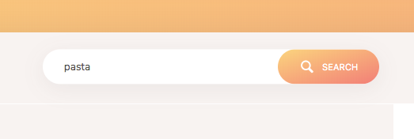

# Recipes & Shopping List App.

This application is purely a demo of the Javascript, HTML, and CSS.

## Table of Contents
- [Getting Started](#getting-started)
- [App Preview](#app-preview)

## Getting Started

* [Download the installer](https://nodejs.org/) for Node.js 6 or greater.
* Clone this repository: `git clone https://github.com/Hogusong/Recipes.git`.
* Run `npm install` in a terminal from the project root.
* Run `npm run build` in a terminal from the project root.
  - 'dist' folder will be created in the project root.
* Copy 'css' and 'img' folder from 'src' and paste them into 'dist'
* Make 'environments' folder in the 'src' and create a new file 'config.js'
  - 'project folder/src/environments/config.js'
* Go to "https://www.food2fork.com/" and register to get the API key.
* Open 'config.js' and add this;

    export const config = {
      key: "your api key here",
      proxy: "https://cors-anywhere.herokuapp.com/"
    }

* Run `npm run start` in a terminal from the project root.

_Note: See [How to Prevent Permissions Errors](https://docs.npmjs.com/getting-started/fixing-npm-permissions) if you are running into issues when trying to install packages globally._

## App Preview

- Search Bar

  

- Main Browser

  

- To see more images of the app, check out the [screenshots directory](https://github.com/Hogusong/Recipes/src/img/screen)!
